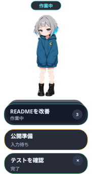

# Lumi Codex Pet

[日本語](README.ja.md)

Lumi is a small, quiet Codex task companion for Hyprland. She stays completely
still most of the time, animates for three seconds when a task actually changes
state, and keeps a compact stack of the main Codex sessions running in Kitty or
tmux.



## What it does

- Shows only main Codex sessions; subagent work is filtered out.
- Keeps active `running` and `waiting` tasks plus completed/failed tasks from
  the last hour.
- Opens older cards directly below the always-visible front card, newest first.
- Focuses the matching Kitty window or tmux pane when a card is clicked.
- Drags smoothly on Hyprland through coalesced compositor IPC, including while
  the card list is open.
- Stores a ten-character task label, not the submitted prompt.
- Captures terminal text only while the card list is open and never persists it.

## Requirements

- Hyprland with a systemd user session
- Python 3.11 or newer
- `curl` and `sha256sum` for the installer
- Kitty and/or tmux
- Codex with Hooks enabled

For Kitty previews and focusing, remote control must be enabled and
`KITTY_LISTEN_ON` must be present in the Codex terminal environment. For
example, in `kitty.conf`:

```conf
allow_remote_control yes
listen_on unix:@kitty-ai-${kitty_pid}
```

## Install

```bash
curl -fsSL https://github.com/Saikoro3/codex-ltmux-pet/releases/latest/download/install.sh | bash
```

The installer verifies a Python 3.11+ executable, creates an isolated virtual
environment, checks the release wheel checksum, and installs only per-user
files. It safely merges Lumi into `~/.codex/hooks.json` without replacing other
hooks.

After installation:

1. Open `/hooks` in Codex.
2. Review and trust the `~/.local/bin/lumi-state-bridge` hooks.
3. Run `lumi-ctl doctor`.

Non-managed hooks require explicit trust in Codex. See the
[official Codex Hooks documentation](https://learn.chatgpt.com/docs/hooks).

## Controls

- Click Lumi: open or close the older-card stack.
- Click the front card: focus its terminal.
- Click an expanded card: focus that terminal.
- Drag Lumi or any expanded card: move the complete surface.
- Click `×` on a completed/failed expanded card: remove only that card.

A short click and a drag are distinguished by the platform drag-distance
threshold. Cards remain part of the same Wayland surface, preventing detached
windows and compositor-selected placement.

## Configuration

The optional user override is:

```text
${XDG_CONFIG_HOME:-~/.config}/codex-ltmux-pet/config.json
```

Runtime state is private to the user:

```text
${XDG_STATE_HOME:-~/.local/state}/codex-ltmux-pet/
```

Example override:

```json
{
  "attention_seconds": 3,
  "finished_retention_seconds": 3600,
  "sprite_width_px": 158
}
```

Environment overrides are available for testing and advanced setups:
`LUMI_CONFIG`, `LUMI_STATE_DIR`, `LUMI_POSITION_FILE`, and
`LUMI_SPRITESHEET`.

## Update and uninstall

Run the install command again to update. Setup is idempotent and keeps existing
state and window position.

```bash
lumi-ctl uninstall
```

This keeps config and state. To remove those plus an unmodified installed Lumi
pet:

```bash
lumi-ctl uninstall --purge
```

Uninstall removes only managed service, desktop, Hyprland, and hook entries.
Other Codex hooks and Hyprland settings are preserved.

## Troubleshooting

Start with:

```bash
lumi-ctl doctor
systemctl --user status lumi-pet.service
journalctl --user -u lumi-pet.service -n 100
```

If Lumi does not receive task updates, run `/hooks` and confirm the command was
trusted. If terminal focusing fails, verify `KITTY_LISTEN_ON` or `TMUX_PANE` is
visible inside the Codex terminal.

`load_workspace_dependencies` is not an end-user installation command. It is an
internal Codex workspace helper used during pet-asset production. The public
installer and `lumi-ctl doctor` perform their own Python and asset checks.

## Development

```bash
git clone https://github.com/Saikoro3/codex-ltmux-pet.git
cd codex-ltmux-pet
uv sync --extra dev
QT_QPA_PLATFORM=offscreen uv run python -m unittest discover -s tests -v
uv run ruff check .
uv build
```

The v2 spritesheet is validated as an 8×11 atlas with 192×208 cells, a
1536×2288 canvas, transparent unused cells, the reserved neutral look cell, and
all 16 direction cells.

## License

Code is licensed under the [MIT License](LICENSE). Lumi artwork is licensed
under [CC BY 4.0](LICENSES/CC-BY-4.0.txt); see [NOTICE.md](NOTICE.md) for the
required attribution.
